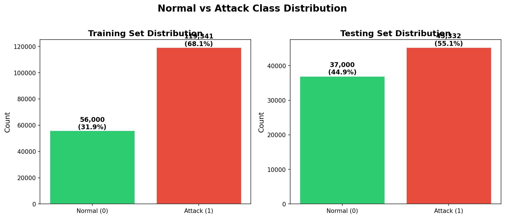
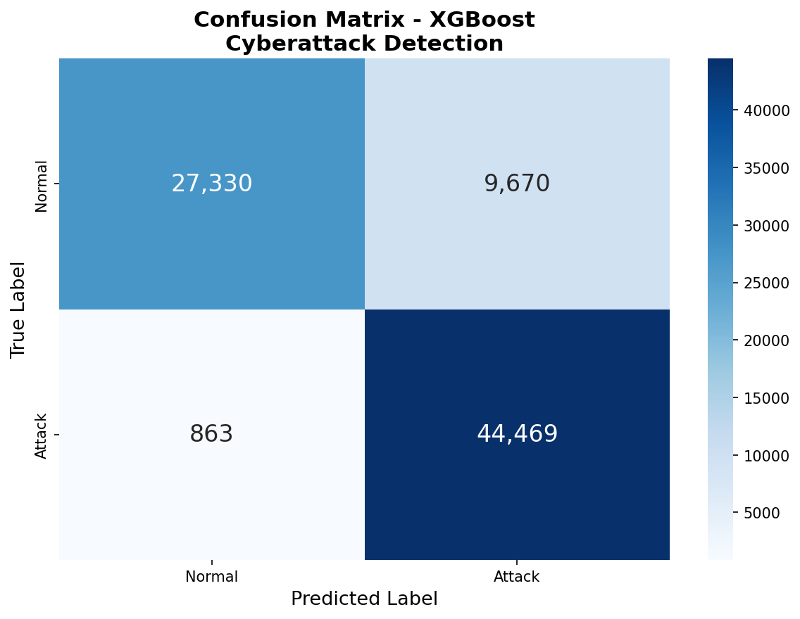
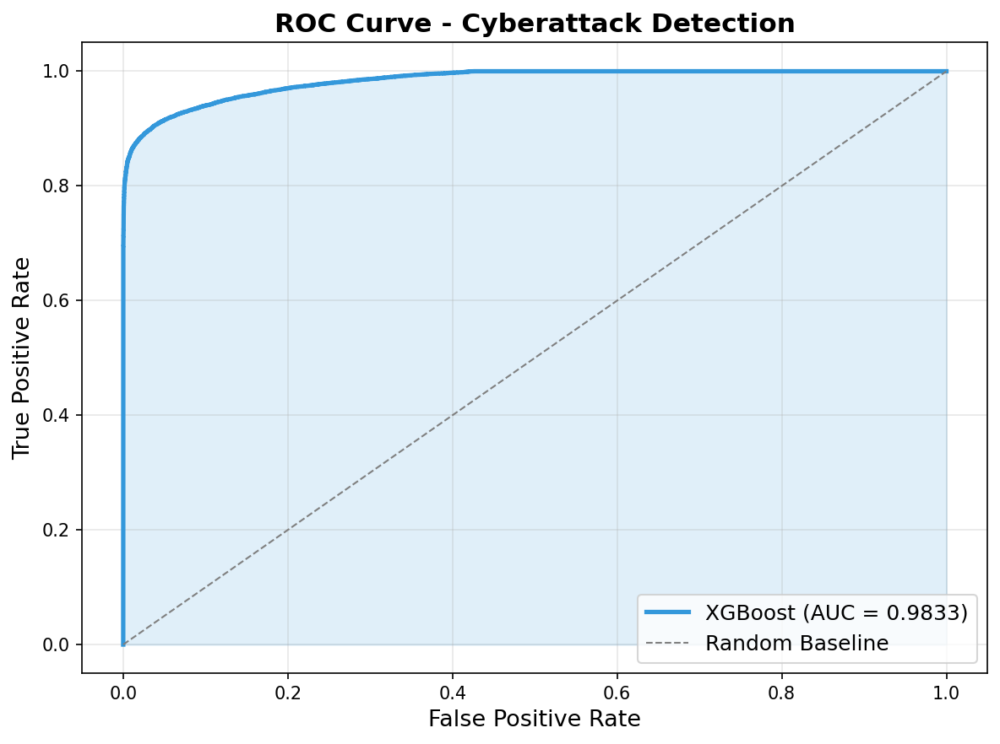
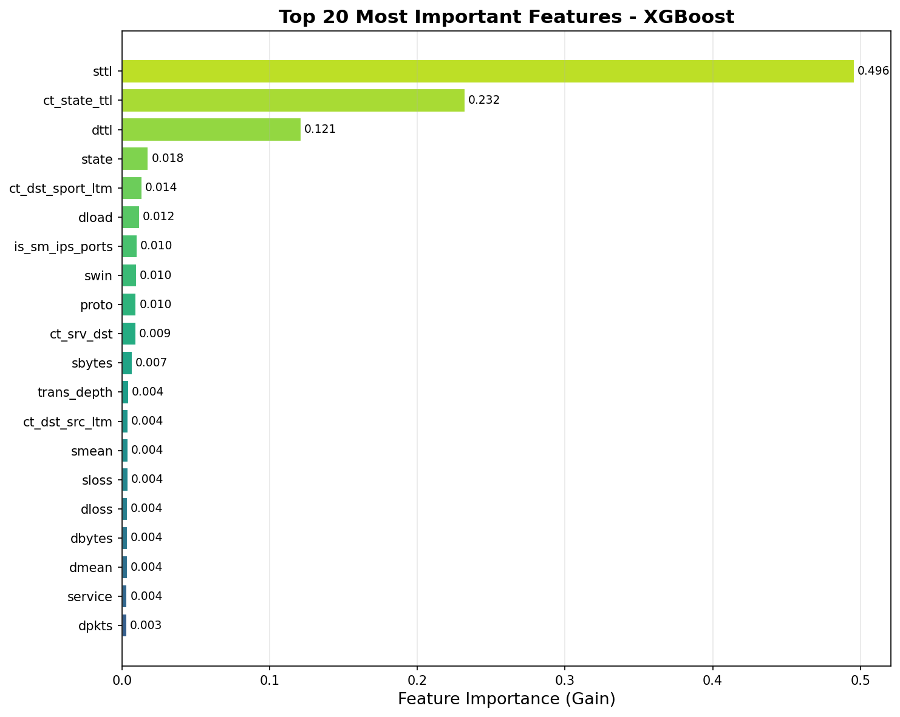
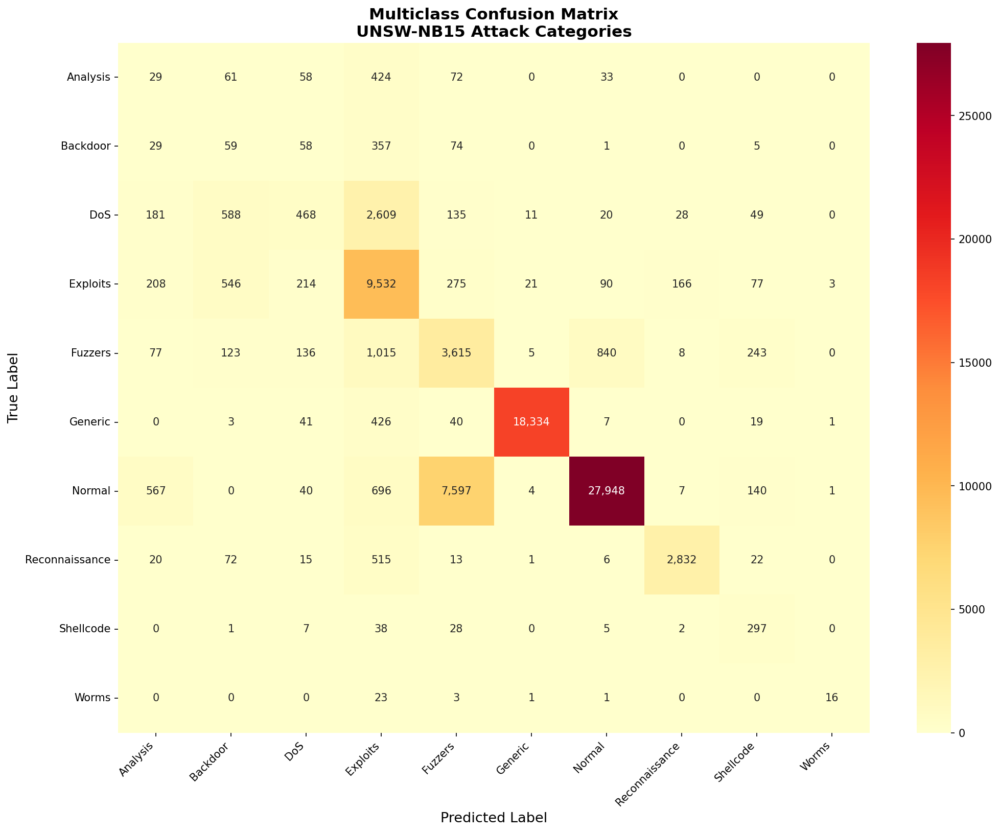

# 🛡️ Cyberattack Detection Using Machine Learning

[](https://colab.research.google.com/github/SAICHARAN1189/Cyberattack_Detection_ML/blob/main/Cyberattack_Detection_ML.ipynb)
[](https://python.org)
[](https://xgboost.readthedocs.io/)
[](https://scikit-learn.org/)

A machine learning system for detecting malicious network traffic using the **UNSW-NB15** dataset. The system classifies network connections as **NORMAL** or **ATTACK** using XGBoost with **98.1% Recall** and **98.3% ROC-AUC**.

---

## 📊 Results at a Glance

| Metric | Score |
|--------|-------|
| **Accuracy** | **87.21%** |
| **Precision** | **82.14%** |
| **Recall** | **98.10%** |
| **F1 Score** | **89.41%** |
| **ROC-AUC** | **98.33%** |
| False Positive Rate | 26.14% |
| **False Negative Rate** | **1.90%** |

> ⚡ **98.1% of all attacks are successfully detected.** Only 863 out of 45,332 attacks are missed.

### Model Comparison

| Model | Accuracy | F1 Score | Training Time |
|-------|----------|----------|---------------|
| Random Forest (Baseline) | 87.03% | 89.34% | 2.8s |
| **XGBoost (Main)** | **87.21%** | **89.41%** | **2.1s** |

---

## 🔍 Problem Statement

Network intrusion detection is critical for cybersecurity. This project builds a **binary classifier** that analyzes network traffic features to identify potential cyberattacks. 

In cybersecurity, **missing an actual attack (false negative) is far more dangerous than a false alarm**:
- ❌ A missed attack can lead to **data breaches**, **ransomware**, and **financial loss**
- ✅ A false alarm only triggers an unnecessary investigation

Therefore, this system **prioritizes high Recall** — catching as many attacks as possible.

---

## 📁 Dataset

**UNSW-NB15** — Created by the Australian Centre for Cyber Security (ACCS).

| Set | Total Samples | Normal | Attack |
|-----|---------------|--------|--------|
| Training | 175,341 | 56,000 (31.9%) | 119,341 (68.1%) |
| Testing | 82,332 | 37,000 (44.9%) | 45,332 (55.1%) |

### Class Distribution

<p align="center">
  
</p>

### Attack Categories (10 classes)
`Normal` · `Generic` · `Exploits` · `Fuzzers` · `DoS` · `Reconnaissance` · `Analysis` · `Backdoor` · `Shellcode` · `Worms`

---

## ⚙️ Features

**42 network traffic features** used after preprocessing:

| Category | Features |
|----------|----------|
| **Flow** | duration, protocol, service, state |
| **Packet** | source/destination packets, bytes, TTL |
| **Content** | HTTP transaction depth, response body length |
| **Time** | jitter, inter-packet arrival time |
| **Connection** | TCP window, sequence numbers, RTT |
| **General** | connection counts, FTP/HTTP indicators |

### Categorical Features (3)
- `proto` — Network protocol (133 unique values)
- `service` — Network service (13 unique values)
- `state` — Connection state (9 unique values)

---

## 🔧 Preprocessing Pipeline

```
Raw Data → Drop ID → Separate Features/Target → ColumnTransformer → Model
                                                    ├── StandardScaler (39 numeric cols)
                                                    └── OrdinalEncoder (3 categorical cols)
```

1. **Drop `id`** — row identifier with no predictive value
2. **Separate targets** — `label` (binary) and `attack_cat` (multiclass)
3. **OrdinalEncoder** for categoricals (handles 133 protocol types efficiently)
4. **StandardScaler** for numerical features
5. **scikit-learn `ColumnTransformer`** — ensures reproducibility, prevents data leakage
6. **Fit on training data only** — test set is transformed, never fitted

---

## 🤖 Models

### Baseline: Random Forest
- 100 trees, max depth 20, all CPU cores

### Main Model: XGBoost Classifier
```python
XGBClassifier(
    n_estimators=300, max_depth=8, learning_rate=0.1,
    subsample=0.8, colsample_bytree=0.8, min_child_weight=5,
    gamma=0.1, reg_alpha=0.1, reg_lambda=1.0,
    tree_method='hist'  # Fast histogram-based
)
```

---

## 📈 Evaluation

### Confusion Matrix

<p align="center">
  
</p>

|  | Predicted Normal | Predicted Attack |
|--|------------------|------------------|
| **Actual Normal** | 27,330 (TN) | 9,670 (FP) |
| **Actual Attack** | 863 (FN) | 44,469 (TP) |

### Classification Report

```
              precision    recall  f1-score   support

      Normal       0.97      0.74      0.84     37000
      Attack       0.82      0.98      0.89     45332

    accuracy                           0.87     82332
   macro avg       0.90      0.86      0.87     82332
weighted avg       0.89      0.87      0.87     82332
```

### ROC Curve

<p align="center">
  
</p>

---

## 🏆 Feature Importance

The **top 3 features** account for **85%** of the model's decision-making:

| Rank | Feature | Importance | Description |
|------|---------|------------|-------------|
| 1 | `sttl` | 0.496 | Source Time-To-Live |
| 2 | `ct_state_ttl` | 0.232 | Connection state + TTL count |
| 3 | `dttl` | 0.121 | Destination Time-To-Live |

> 💡 **Insight:** Attackers often manipulate TTL values in packets, which is why TTL-based features dominate the model's decisions.

<p align="center">
  
</p>

---

## 🚀 How to Run

### 1. Install Dependencies
```bash
pip install -r requirements.txt
```

### 2. Train the Model
```bash
python train_model.py
```
This trains both models, evaluates, generates plots, saves the model, and runs prediction demos.

### 3. Make Predictions
```bash
python predict.py
```

### 4. Run on Google Colab
[](https://colab.research.google.com/github/SAICHARAN1189/Cyberattack_Detection_ML/blob/main/Cyberattack_Detection_ML.ipynb)

Upload the CSV files and run all cells to see interactive results.

### 5. Use in Your Code
```python
from predict import load_model, predict

pipeline = load_model()
result = predict(sample_data, pipeline)

print(result['prediction'])   # 'NORMAL' or 'ATTACK'
print(result['confidence'])   # e.g., 98.5
```

---

## 🔮 Example Prediction

```
Sample #500:
  Prediction:  ATTACK (confidence: 100.0%)
  Actual:      ATTACK
  Probabilities: Normal=0.0000 | Attack=1.0000

Sample #100:
  Prediction:  NORMAL (confidence: 99.6%)
  Actual:      NORMAL
  Probabilities: Normal=0.9958 | Attack=0.0042
```

---

## 🎯 Optional: Multiclass Classification

Also built a **10-class classifier** to identify specific attack types:

| Metric | Score |
|--------|-------|
| Accuracy | 76.68% |
| F1 (weighted) | 78.15% |

<p align="center">
  
</p>

Run with:
```bash
python train_multiclass.py
```

---

## 📂 Project Structure

```
Cyberattack_Detection_ML/
├── UNSW_NB15_training-set.csv         # Training data (175,341 samples)
├── UNSW_NB15_testing-set.csv          # Testing data (82,332 samples)
├── Cyberattack_Detection_ML.ipynb     # Google Colab notebook
├── train_model.py                     # Binary classification pipeline
├── train_multiclass.py                # Multiclass classification (optional)
├── predict.py                         # Prediction module + demo
├── requirements.txt                   # Python dependencies
├── README.md                          # This file
├── cyberattack_model.pkl              # Saved binary model + preprocessor
├── multiclass_model.pkl               # Saved multiclass model
├── preprocessing.pkl                  # Saved preprocessor (standalone)
└── plots/
    ├── class_distribution.png         # Normal vs Attack distribution
    ├── confusion_matrix.png           # Binary confusion matrix
    ├── roc_curve.png                  # ROC curve (AUC=0.9833)
    ├── feature_importance.png         # Top 20 feature importances
    └── multiclass_confusion_matrix.png # 10-class confusion matrix
```

---

## 🛠️ Tech Stack

| Tool | Purpose |
|------|---------|
| Python | Programming language |
| pandas & NumPy | Data manipulation |
| scikit-learn | Preprocessing, pipeline, metrics |
| XGBoost | Main classifier |
| matplotlib & seaborn | Visualizations |
| joblib | Model serialization |

---

## 🔮 Future Improvements

1. **Hyperparameter optimization** — Bayesian optimization with Optuna
2. **Feature engineering** — Interaction features, polynomial features
3. **Ensemble stacking** — Combine XGBoost + LightGBM + CatBoost
4. **Real-time detection** — Deploy as a streaming pipeline with Kafka
5. **Threshold tuning** — Optimize decision threshold for recall vs precision
6. **SHAP explainability** — Individual prediction explanations
7. **Deep learning** — LSTM/Transformer for sequential traffic patterns

---

## 🔑 Key Cybersecurity Insight

> **Why Recall matters more than Accuracy in cybersecurity:**
>
> A **False Negative** (missed attack) means malicious traffic passes through undetected, potentially causing data breaches, ransomware deployment, or network compromise. Our model's **1.90% False Negative Rate** means only 1.9% of attacks slip through — making it suitable for production security monitoring.

---

*Built for ML Workshop — Cyberattack Detection Competition*
